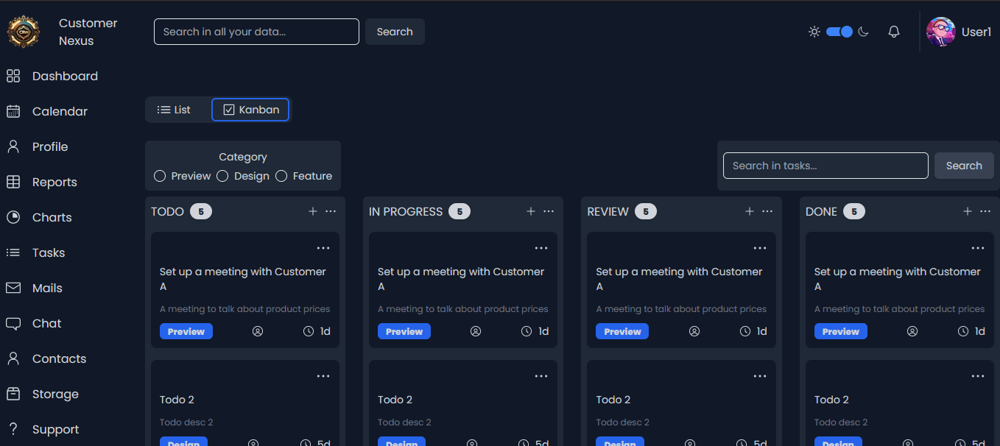

## A CRM software for any scale business

Dashboard 

Tasks 

### Features

- Dashboard to see your all data
- Task board for your tasks
- Notifications to make you ready for any event
- Calendar, Mails and Files tabs to keep track your daily flow
- Help desk to answer your customers's questions quickly

### Tech Stack

- Tailwind
- Shadcn UI
- Tremor.so
- Next.js
- Typescript
- Clerk
- Express
- Socket.io
- Supabase
- Algolia
- Nylas
- Kubernetes
- ELK Stack

### Integrations

- Realtime Chat
- Calendar, Mail, Files access
- ...more coming soon
